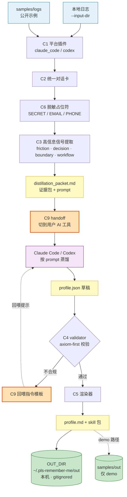

# pls-remember-me · 架构

> 一句话：把你和各种 AI 工具的历史对话整理成可追溯证据包，再借助用户自己选择的 AI 工具蒸馏成第一份个人 context seed，输出"我是谁、我怎么判断、我希望 AI 怎么配合我"的 context / 原则 / skill。
>
> 对照物：女娲（nuwa-skill）蒸馏别人、公开数据、一次性；本项目蒸馏自己、私有对话、持续。

---

## -1. 初心：启动个人 context infrastructure

本项目来自对 [yage.ai/context-infrastructure](https://yage.ai/context-infrastructure.html) 的产品化回应。那篇文章的核心不是"把聊天记录总结成个人简介"，而是：

**AI 默认会回到大众平均答案。要让 AI 更像一个理解你判断方式的合作者，关键不是再写几句 system prompt，而是把你长期行为里稳定出现的判断原则、协作偏好、边界意识和反复纠错，沉淀成可被 AI 读取的上下文基础设施。**

所以本项目的长期方向不是 memory backend，也不是聊天记录总结器，而是帮重度 AI 用户搭起自己的个人 context infrastructure。完整形态包括四件事：

1. **大量积累**：从 AI 对话、纠正、项目记录、会议、私有笔记等真实行为数据里积累材料。
2. **分层提炼**：从原始材料中提取观察，再合并成稳定模式，最后沉淀为判断原则。
3. **按需加载**：不同任务加载不同 context，不把所有历史一次性塞给 AI。
4. **循环更新**：AI 消费 context 产出工作结果，工作过程再反过来生成新的 context。

v1 只做第一步：从最容易拿到的 Claude Code / Codex 历史对话里，生成可追溯证据包和第一版个人 context seed。它是启动器，不是完整终局。

## 0. 第一原则（违反即架构错）

1. **本仓库永不包含可识别、可回溯的真实个人数据。** 只有机制 + 公开示例语料。示例可以受真实 dogfood 启发，但必须合成化，用户的真实画像/对话/原始产物只存在于用户本机，永不进 git。
2. **项目是流水线，不是 skill。** skill 只是流水线的一种产物。把项目本体做成 skill 是形态错误。
3. **无中心化服务。** 项目方不托管、不收集、不默认上传真实对话；用户可主动选择自己的 AI 工具处理自己的数据。
4. **零数据可演示。** 陌生人 clone 后不接自己任何数据，一条命令、30 秒看到产物——靠 `samples/`。
5. **v1 是 context seed，不是完整 infrastructure。** 窄 loop 跑通优先，先让非熟人蒸出第一版可用画像，再逐步补持续积累、分层提炼、按需加载和循环更新。

## 1. 三层边界

| 层 | 是什么 | 形态 | 在本仓库 |
|---|---|---|---|
| **L1 流水线** | 把对话日志 ETL 成证据包，并校验 / 渲染画像产物的批处理 | 一组脚本 + CLI + prompt | ✅ 核心 |
| **L2 产物** | 蒸出来的画像 | (a) 可粘贴进 web LLM 的 `.md`；(b) 用户自带数据渲染出的 `SKILL.md` 包（可由用户 `cp` 进 `~/.claude/skills/` 或 `npx skills add` 装入自己 AI 客户端，但**装的是用户的画像数据 skill，不是项目本体**）| ⚠️ 只产**示例**产物；真实产物落用户本机 `OUT_DIR` |

**项目本体不是 skill，没有 L3 分发壳。** 安装方式是 `git clone` + `python3 scripts/...`。理由：本项目的活儿发生在批处理时（把语料整理成证据包，并校验 / 渲染画像产物），而 `npx skills` 生态装的是"让 AI 在推理时调用的能力"——形态不匹配。`npx skills add` 形态只出现在 L2 输出（用户的画像 skill 包），不出现在项目本体。

判定规则：**"别人也能用的机制"才进仓库；"关于你这个人的内容"永不进。**

## 2. 数据流

```
输入日志(--input-dir)
   │   adapters/ 按平台解析 → 统一消息结构
   ▼
[ingest]  清洗：去系统提示/工具日志/技能文本，脱敏 API key / 邮箱 / 手机号
   ▼  cleaned messages
[signals] 提取高信息片段（纠正/推翻/重做、反复决策、边界声明、优先级取舍）
   ▼  signal snippets + distillation_packet.md
[用户自选 AI 工具] 按 prompts/distill_profile.md 蒸馏 → profile.json
  （v1 主路径建议 Claude Code / Codex；其他 AI 工具不排除，但不作为 v1 承诺）
   ▼
[validate/render] 校验 C4 结构与出处 → profile.md + skill 包
   ▼
OUT_DIR/ (用户本机，gitignored，永不提交)
```

### 2.1 流程图（含 C9 回喂控制环）



**读图要点**：

- **橙色块（C9）= 边界跨越点**。流水线在这里把控制权交出去，由用户在自己选择的 AI 工具里完成蒸馏；然后再把 AI 产出的 `profile.json` 喂回来。这是 v1 真实路径的一半，不是实现细节。
- **回喂环（V1 → H2 → U1）= P0 必须支持**。validator 不合规时，不能只报错——必须输出可直接复制给 AI 的回喂指令。
- **绿色块 = 永不进 git**。`.gitignore` 物理拦截。真实产物只存在用户本机 `OUT_DIR`；`samples/out` 仅用于零数据 demo。
- **黄色块 = 流水线产物**。`distillation_packet.md` 和 `profile.json` 都是结构化合同，不是自由文本。

### 2.2 两条运行路径

两条运行路径，同一条流水线：

- **demo 路径**：`--input-dir samples/logs` → 产物写 `samples/out/`（可对照 `samples/EXPECTED.md`）。陌生人零配置体验。
- **真实路径**：用户 `--input-dir <自己导出的日志目录>` → 生成证据包 → 用 Claude Code / Codex 按 prompt 蒸馏（其他 AI 工具可自行尝试，但不是 v1 主路径承诺）→ 产物写 `OUT_DIR`（默认 `~/.pls-remember-me/out`）。

关键解耦：流水线**只认 `--input-dir`**，不再硬编码 `Path.home()/.codex` 等本机路径（这是从旧项目抽过来必须做的第一个改动，也是"陌生人能跑"的瓶颈）。

运行边界：本项目不承诺"不联网 / 不调云"，因为用户可能主动选择联网 AI 工具参与蒸馏；本项目承诺的是**不建设中心化服务，不收集、不托管、不默认上传用户真实对话**。

引用边界：流水线内部可以保留 `raw_ref` 做本机审计，但任何会交给 AI 工具、进入 `profile.json/profile.md`、进入 `samples/` 或公开文档的产物，只能使用不含本机路径/项目名/仓库名的 `public_ref`。

## 3. 目录结构

```
pls-remember-me/
├── README.md              # 面向陌生人，第一屏 30 秒证明它是真的
├── LICENSE                # MIT（著作权人 待确认）
│                          #（无顶层 SKILL.md——项目本体不是 skill）
├── .gitignore             # 物理拦截一切个人产物
├── scripts/
│   ├── ingest.py          # --input-dir + 清洗 + 脱敏
│   ├── friction.py        # 高信息片段提取 + distillation_packet.md 生成（文件名沿用，职责不只摩擦）
│   ├── validate_profile.py # 校验用户 AI 工具产出的 C4 画像
│   ├── render.py          # 画像 → profile.md + skill 包
│   ├── run_demo.sh        # 一键零数据 demo
│   └── pls_remember_me.py # CLI 总入口：prepare / validate / render / demo（子命令）
├── adapters/              # 按平台的日志解析器
│   ├── claude_code.py     # v1
│   └── codex.py           # v1   （hermes = v1.1；chatmemo / 网页端导出 = v2+）
├── samples/
│   ├── logs/              # 公开示例对话（可受真实 dogfood 启发，但必须合成化）
│   └── EXPECTED.md        # demo 参考产物，用户用来确认"我跑对了"
├── prompts/
│   └── distill_profile.md # 给用户自选 AI 工具的蒸馏提示词
├── templates/             # L2 skill 壳模板（无任何个人数据）
└── docs/
    └── architecture.md    # 本文件 —— 边界宪法，改架构前先读
```

## 4. v1 scope（硬切线）

**要做**：`--input-dir` 解耦 · Claude Code + Codex 的 `.jsonl` 解析 · 高信息片段提取 · 生成蒸馏证据包和 prompt · 校验用户用 Claude Code / Codex 等工具产出的 profile JSON · 渲染 profile.md（+ 一个 skill 包）· `samples/` 零数据 demo · MIT 公开 README。

**v1.1 加**：Hermes Agent adapter；更多来源的积累；更自动化的 AI 蒸馏路径实验。

**不做（=v2+）**：OpenClaw / QClaw / Cursor / OpenCode / Gemini CLI / ChatMemo / 网页端 ChatGPT / Claude / DeepSeek / 豆包 / Kimi 等导出格式 · 中心化托管服务 · 自动上传处理 · 真增量与去重流水线 · 多人物画像 · web UI · Observer / Reflector / Axiom 式长期分层系统 · 任务路由与按需加载。

**永不做**：把个人产物提交进仓库 · 项目方默认收集 / 上传 / 托管用户真实对话。

## 5. 与旧项目的关系（已定：模型 A）

旧项目 `personal-context-infrastructure` = 你的私有运行实例（含真实画像，留在 iCloud，不动）。
本仓库 = 一次性从旧项目抽**干净的机制**，之后两边独立演进。

- 过来：`scripts/` 逻辑（去本机硬编码）、skill 壳、axioms 的通用结构。
- **永不过来**：`contexts/`、`state/`、`logs/`、`*-friction.jsonl`、`chatmemo_raw/`、绑本机路径的 cron。
- 已知代价：脚本改进要手动两边同步，会漂移。等 v1 拿到第一个非熟人反馈再决定是否收敛成"私有实例反过来依赖本开源工具"（模型 B）。

## 6. 待确认

- [x] LICENSE 著作权人署名 → 用 GitHub ID（具体 ID 字符串待补）
- [x] ~~`OUT_DIR` 默认位置~~ → 已定（v0.8.5，见 v1-plan §7.1）：`~/.pls-remember-me/out`
- ~~用户真实日志导出方式：是否自带"从 ~/.claude、~/.codex 拷到一个目录"的辅助脚本~~ → 已定：**不做**。按 v1-plan §1.5"不为非目标用户加便利 hedge"原则——目标用户能 `git clone` 也能 `cp`。
- ~~CLI 是 Python 直跑还是包一层 `npx`/node 入口~~ → 已定：**Python 直跑**。项目本体不是 skill，不进 `npx skills` 生态（见 §1）。
- [x] ~~"跑通"定义最终措辞~~ → 已定（见 v1-plan §1.3）：非熟人在自己日志跑出来并反馈改变了协作方式 **或** 第一条主动 inbound（合作 / 求助 / 引用）；**明确不是 star 数**。
